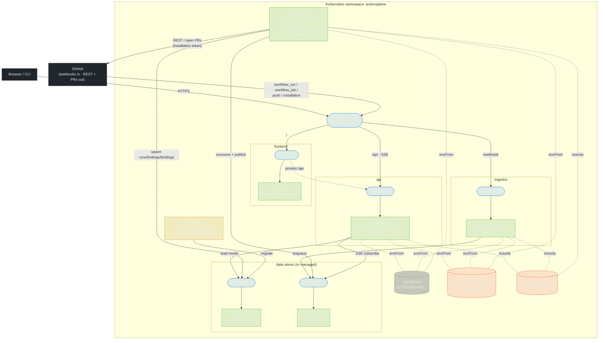

# ActionsPlane — Kubernetes services-level architecture

How the components map to Kubernetes objects and how traffic flows between them. Manifests live
in `deploy/k8s/` (kustomize) and `deploy/helm/actionsplane/` (Helm chart); per-component images
are built from `deploy/docker/`.

## Reading the diagram

**Ingress** is the only entry point. It fans out by path: `/` to the **frontend** Service (nginx
serving the React SPA, which also reverse-proxies `/api` + the SSE stream), `/api` to the **api**
Service, and `/webhook` to the **ingestor** Service so GitHub deliveries reach the receiver directly.

**Three stateless, horizontally-scaled tiers** sit behind Services — `frontend`, `api`, `ingestor`
(2 replicas each). The **worker** has *no* Service (nothing connects to it inbound) and runs as a
**single replica** on purpose: it owns the arq cron sweeps (reconcile / audit / drift), which must
not be double-scheduled.

**Data plane:** Redis is the seam between tiers — the ingestor *enqueues* events, the worker
*consumes* them and *publishes* live ticks, and the api *subscribes* to relay those ticks over SSE.
Postgres holds the event-sourced read model; the api reads it, the worker writes it. Both are shown
as in-cluster (a Postgres `StatefulSet` + PVC and a Redis `Deployment`) for evaluation; in
production disable them in values and point at managed services.

**Config & secrets:** a `ConfigMap` supplies the non-secret `ACTIONSPLANE_*` env; one `Secret`
carries env-injectable values (DB URL, webhook secret, API token) and a *separate* `Secret` carries
the GitHub App private key, mounted read-only at `/secrets/github-app.pem`. App pods run non-root
with a read-only root filesystem (plus a writable `/tmp`).

**Migration** runs as a Helm `pre-install`/`pre-upgrade` hook Job (`alembic upgrade head`) so the
schema is current before any app pod starts; re-running is a no-op.

**Egress to GitHub** is only from the worker (and the campaign executor it hosts): REST reads for
reconciliation/audit and PR creation, authenticated with short-lived per-installation tokens.
